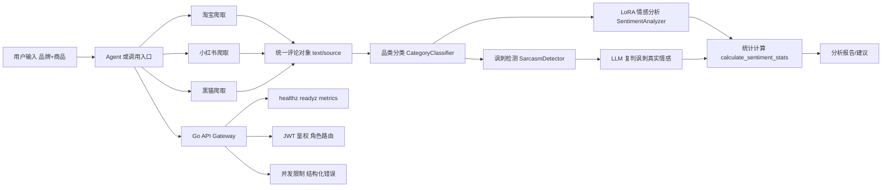

# 第1章 作品概述

本作品主题是“多源商品口碑可信分析”，核心目标是帮助用户在购买前快速识别潜在风险，减少“被营销内容误导”与“只看单平台评价导致决策偏差”的问题。

创意来源于真实消费场景中的三个矛盾：
1. 同一商品在电商平台显示“高好评”，但在社交平台和投诉平台可能存在明显负向反馈。
2. 传统评价分析往往只做关键词统计或简单情感分类，难以识别“阴阳怪气/反讽”文本。
3. 数据抓取、分析服务、接口治理常耦合在一起，稳定性和可扩展性不足。

本作品面向的用户群体主要包括：
1. 普通消费者：在购买前进行风险评估。
2. 内容创作者/测评账号：做跨平台口碑对比。
3. 运营或质量团队：快速观察某品牌在不同平台的舆情分布。

目前代码仓库已实现的主要功能包括：
1. 多源数据采集：淘宝评论、小红书笔记、黑猫投诉。
2. 品类识别：关键词规则匹配，LLM 兜底。
3. 情感分析：按品类路由 LoRA 模型进行正负向判断。
4. 反讽识别：独立讽刺检测与 LLM 复判机制。
5. 结果汇总：统一统计好评率、差评率与反讽占比。
6. Go 网关治理：健康检查、就绪检查、JWT 鉴权、并发限制、指标快照。

作品特色是“多源证据 + 分层架构”：Python 侧聚焦数据与模型能力，Go 侧聚焦服务治理与工程稳定性，两者可并行演进 [1][2]。

应用价值在于：
1. 给消费者提供更接近真实体验的购买参考。
2. 给业务侧提供可解释的口碑风险线索。
3. 为后续社区版、企业版扩展预留工程基础。

推广前景方面，仓库中已具备从“工具化分析”向“平台化服务”迁移的基础能力；后续可扩展到更多品类、更多数据源与更规范的在线服务形态。

# 第2章 问题分析

## 2.1 问题来源

问题来源于“商品口碑信息分散且质量不一致”的行业现状：
1. 电商平台评价存在刷评、模板化好评、短文本语义不足等情况。
2. 社交平台文本更真实但噪声大，且存在反讽表达。
3. 投诉平台问题集中但多为负向事件，不能直接替代全面评价。

当用户只看单一来源时，容易出现判断偏差：
1. 高销量商品仍可能有质量或售后风险。
2. 看似好评的文本可能是反讽表达。
3. 平台间信息差导致“局部最优”决策。

## 2.2 现有解决方案

基于仓库现状和常见方案，可归纳为以下几类：
1. 单平台评论分析：仅抓取电商评论，做关键词或情感统计。
2. 纯大模型问答：直接让 LLM 根据少量输入给建议。
3. 投诉检索工具：以投诉数据为主做风险提示。
4. 通用反向代理方案：仅转发请求，不提供领域鉴权/限流/观测闭环。

与本作品的多维对比如下：

| 维度 | 单平台评论分析 | 纯大模型问答 | 投诉检索工具 | 本作品（SpotTruth） |
| --- | --- | --- | --- | --- |
| 数据来源 | 单一 | 依赖输入上下文 | 单一负向 | 淘宝+小红书+黑猫 |
| 反讽识别 | 通常无 | 不稳定 | 通常无 | 独立检测 + LLM 复判 |
| 品类适配 | 弱 | 弱 | 无 | 品类路由 + LoRA |
| 工程治理 | 弱 | 取决于部署 | 弱 | Go 网关鉴权/限流/可观测 |
| 可扩展性 | 中 | 中 | 中 | 高（分层架构） |

现有方案的主要不足是“证据链短”和“治理能力弱”。本作品通过多源融合和服务分层，目标是同时提升结论可信度与系统可运营性 [2][3]。

## 2.3 本作品要解决的痛点问题

结合 2.2 对比，本作品聚焦以下核心痛点：
1. 口碑结论偏单一：缺乏跨平台证据融合。
2. 语义误判：无法有效处理阴阳怪气、讽刺类文本。
3. 模型泛化弱：不同品类语义差异导致统一模型效果不稳。
4. 工程不稳：缺少标准化鉴权、限流、健康探针和指标观测。
5. 联调成本高：模型服务和网关治理边界不清，排障困难。

## 2.4 解决问题的思路

### 2.4.1 功能和性能需求

功能需求：
1. 支持品牌+商品查询并抓取多源文本。
2. 支持评论品类判断并路由到对应分析链路。
3. 支持“反讽检测 + 情感分析 + 汇总统计”。
4. 支持网关级鉴权、限流、健康检查、指标输出。

性能与稳定性需求：
1. 网关应在高并发时快速失败并返回可重试语义。
2. 网关应提供 liveness/readiness 分层探针。
3. 网关应提供关键指标快照，支持联调定位。

### 2.4.2 数据集说明

一、在线采集数据（已在代码实现中体现）
1. 数据来源：
   - 淘宝商品评论。
   - 小红书搜索结果详情文本。
   - 黑猫投诉标题/文本。
2. 数据格式：统一为文本对象列表，典型结构为 {"text": "...", "source": "taobao/xiaohongshu/heimao"}。
3. 数据获取方式：Selenium 自动化抓取，结合登录态复用。
4. 数据特点：
   - 淘宝数据量大、噪声中等。
   - 小红书文本较长、主观性强。
   - 黑猫数据负向集中、投诉指向明确。
5. 数据规模：
   - 【留空】

二、训练数据（按你的要求留空，由你填写）
1. 数据来源：
   - 【留空】
2. 数据格式：
   - 【留空】
3. 数据规模：
   - 【留空】
4. 划分方式：
   - 【留空】

### 2.4.3 数据样例（来自仓库已有文件）

1. 淘宝评论样例：
   - “很好喝日期新鲜发货速度也很快 很好吃很喜欢吃”
   - “快递非常暴力，不知道为什么会变成这样”
2. 小红书样例：
   - “这款洗发水打着控油的旗号，一点都不控油...”
3. 黑猫投诉样例：
   - “味滋源京东自营平台 出售发霉食品”

### 2.4.4 指标与验证要求（第5章对应印证）

1. 指标 I1：网关健康与就绪语义正确。
2. 指标 I2：鉴权链路具备 401/403 区分能力。
3. 指标 I3：并发超限时返回 503 + Retry-After + 结构化错误码。
4. 指标 I4：指标接口输出关键观测字段（请求总量、状态码分布、限流命中等）。
5. 指标 I5：多源分析链路输出统一结构，包含 source/sentiment/sarcasm 关键字段。

# 第3章 技术方案

## 3.1 总体方案

本系统采用“数据采集层 - 分析工具层 - 服务治理层”的三层架构：
1. 数据采集层：负责多平台文本抓取与结构化。
2. 分析工具层：负责品类识别、情感分析、反讽检测、统计汇总。
3. 服务治理层：负责网关代理、鉴权、限流、探针与可观测。

技术路线框架图：

## 3.2 分模块技术说明

### 3.2.1 多源采集模块

1. 淘宝模块：支持品牌+商品搜索、候选商品选择、评论抓取和去重。
2. 小红书模块：抓取搜索结果 URL，并二次进入详情页提取正文。
3. 黑猫模块：按关键词收集投诉文本并持久化。

关键实现点：
1. 登录态管理：通过浏览器 profile/cookie 复用降低重复登录成本。
2. 去重策略：基于文本哈希去重，减少重复样本干扰。
3. 输出统一：不同来源统一映射到 text/source 结构。

### 3.2.2 品类分类模块

采用“规则优先，LLM 兜底”策略：
1. 先用关键词字典匹配（低成本、可解释）。
2. 命中失败时调用 Kimi 进行语义判断（提升召回）。

### 3.2.3 情感与反讽联合分析模块

1. 情感分析：以 hfl/chinese-roberta-wwm-ext 作为基座，加载各品类 LoRA 适配器进行二分类或三分类。
2. 反讽检测：独立模型先判断是否讽刺。
3. 复判机制：对高置信讽刺文本，交给 LLM 判断真实情感。
4. 汇总统计：合并普通文本与讽刺文本结果，输出好评率/差评率等指标。

核心统计公式：

$$
PositiveRate = \frac{N_{positive}}{N_{positive}+N_{negative}},\quad
NegativeRate = 1-PositiveRate
$$

### 3.2.4 网关治理模块（Go）

1. 反向代理：将业务请求转发至上游服务。
2. 配置中心：所有核心参数支持环境变量覆盖并带默认值。
3. JWT 鉴权：支持 user/admin/system 角色声明与路径级权限控制。
4. 并发限制：在途请求超过阈值时快速返回 503。
5. 可观测：请求日志与 /metrics 快照输出。
6. 探针分层：/healthz 与 /readyz 分别对应存活和就绪。

## 3.3 模型、协议、算法与改进点

1. 模型：RoBERTa + LoRA（开源基座与参数高效微调）[4][5]。
2. 反讽方向：参考“阅读字里行间”的反讽建模思路，结合本项目流程做工程化融合 [6]。
3. 协议：服务间以 HTTP/REST 协作，鉴权使用 JWT（HS256）[7]。
4. 改进点：将“反讽检测 + LLM复判 + 品类路由 LoRA”串联，解决单模型误判问题。

## 3.4 原创与非原创说明

原创工作（详述）：
1. 多源爬取结果的统一结构化与联动分析流程。
2. 反讽检测与 LoRA 情感分析的分流融合策略。
3. Go 网关治理能力与 Python 分析能力的分层协同。

非原创工作（简述）：
1. 基座语言模型与 LoRA 微调框架。
2. JWT 标准协议与常见中间件设计模式。
3. Selenium 自动化抓取技术。

# 第4章 系统实现

## 4.1 软件设计与代码组织

工程整体采用“多目录分治”方式：
1. AIGC：多平台采集脚本与相关能力。
2. new_idea：品类分类、LoRA 分析、MCP 工具、Agent 联调脚本。
3. go_backend：网关服务与治理模块（auth/config/gateway/middleware/observability）。

这种组织方式实现了“采集、分析、服务治理”职责隔离，便于迭代。

## 4.2 关键实现过程

### 4.2.1 采集链路实现

1. 淘宝：先搜索候选商品，再进入详情页抓评论并去重。
2. 小红书：先取搜索结果链接，再读取详情页正文文本。
3. 黑猫：按关键词抓取投诉文本并输出列表。

### 4.2.2 分析链路实现

1. 分类：关键词匹配优先，LLM 兜底。
2. 反讽：先检测，再对高置信疑似反讽做 LLM 复判。
3. 情感：正常文本进入 LoRA 模型。
4. 汇总：统一产出每条文本和统计结果。

### 4.2.3 网关链路实现

1. 入口服务启动后加载配置并构建反向代理。
2. 对外暴露 healthz/readyz/metrics。
3. 对业务路由执行鉴权与并发控制，再转发上游。
4. 记录请求日志和关键计数。

## 4.3 数据来源实现

1. 采集数据由 Selenium 脚本实时抓取。
2. 临时数据存于文本文件，统一转换为 JSON 风格对象供后续分析。
3. 知识库目录支持按品类增量维护。

## 4.4 数据训练实现

按你的要求留空：
1. 训练流程：
   - 【留空】
2. 训练参数：
   - 【留空】
3. 训练资源：
   - 【留空】
4. 模型对比与迭代：
   - 【留空】

## 4.5 用户界面与前端实现

按你的要求留空（app.py 暂时闲置，/web_app 暂时闲置）：
1. 界面流程：
   - 【留空】
2. 前端交互：
   - 【留空】
3. 页面展示：
   - 【留空】

## 4.6 系统部署方法

当前仓库可见的部署方式主要为本地分进程启动：
1. Python 侧服务进程。
2. Go 网关进程。
3. Agent 进程（按需）。

可通过环境变量控制网关地址、上游地址、超时与鉴权参数。

## 4.7 实现中的困难与解决方法

1. 登录态频繁失效：通过统一浏览器 profile 与 driver 复用缓解。
2. 多平台数据格式不一致：通过统一 text/source 结构解决。
3. 反讽文本影响情感准确性：通过“检测 + 复判”分流策略缓解。
4. 高并发下上游风险：通过网关并发阈值与快速失败保护。
5. 跨平台路径差异：当前仍存在 Windows 路径硬编码，后续需环境化改造。

# 第5章 测试分析

## 5.1 验证数据来源与规模

一、已执行验证（本次可复现）
1. Go 后端单元测试：覆盖 auth/config/gateway/middleware 关键模块。
2. 运行结果：全部通过。

二、仓库中已有但本次未执行的验证脚本
1. Python 侧 mcp_test 系列脚本。
2. 原因：依赖真实站点、登录态、浏览器驱动与外部 API，当前环境下不具备稳定自动回归条件。

三、测试数据来源
1. 功能样例文本来自仓库中的临时数据文件（淘宝评论、小红书详情、黑猫投诉）。
2. 规模说明：
   - 【留空】

## 5.2 测试过程

1. 执行 Go 测试命令：go test ./...
2. 检查通过包：
   - internal/auth
   - internal/config
   - internal/gateway
   - internal/middleware
3. 检查无测试文件包：
   - cmd/api-gateway
   - internal/observability

## 5.3 测试结果与指标印证

| 指标 | 第2章定义 | 验证方式 | 结果 |
| --- | --- | --- | --- |
| I1 | 健康/就绪探针语义 | gateway 单测（healthz/readyz） | 通过 |
| I2 | 鉴权 401/403 区分 | auth 与 gateway 鉴权单测 | 通过 |
| I3 | 并发超限语义 | concurrency limiter 单测 | 通过 |
| I4 | 指标字段输出 | metrics 端点单测 | 通过 |
| I5 | 多源统一结构输出 | 代码检查与样例文件核对 | 已实现结构，待大规模回归 |

补充说明：
1. 目前可严格证明的是“网关与鉴权治理能力”稳定可用。
2. 端到端真实业务效果（抓取成功率、模型准确率、用户满意度）仍需在统一实验条件下补测。

## 5.4 对比分析与结论

1. 相比无治理的直接调用方式，当前网关层已具备可观测、可限流、可鉴权的最小闭环。
2. 相比仅情感分类，当前流程增加反讽检测与复判，具备更强语义纠偏潜力。
3. 当前最大短板在“可重复的大规模端到端测试基线”尚未固化。

## 5.5 真实性与局限性声明

1. 未经自动化对比实验的数据指标不做定量宣称。
2. 训练效果指标按你的要求留空，待你补充实验结果后再定稿。

# 第6章 作品总结

## 6.1 作品特色与创新点

1. 多源融合：同一商品整合电商评价、社区内容与投诉信息。
2. 语义增强：引入反讽检测与 LLM 复判，补足传统情感分析盲区。
3. 品类路由：按品类选择分析模型，降低跨域误判。
4. 工程治理：Go 网关提供鉴权、限流、探针与指标能力。
5. 架构解耦：分析能力与服务治理分层，便于后续扩展。

## 6.2 应用推广

可优先从以下场景推广：
1. 消费者端“避坑决策”助手。
2. 品牌舆情与售后问题预警看板。
3. 内容平台的商品测评辅助工具。

推广建议：
1. 先做垂直品类试点，形成标准分析模板。
2. 补齐数据合规与隐私策略，建立可持续采集机制。
3. 对外提供标准化 API，降低接入门槛。

## 6.3 作品展望

1. 引入熔断与降级机制，增强下游异常时的稳定性。
2. 接入标准监控栈（Prometheus/Grafana）做实时看板。
3. 推进端到端自动化回归，形成可重复评测基线。
4. 扩展到更多平台与更多细分品类。
5. 训练与评估部分：
   - 【留空，待你补充】

# 参考文献

[1] SpotTruth 仓库根目录 README。
[2] SpotTruth go_backend/README 及设计文档。
[3] SpotTruth go_backend/docs/设计与可扩展性说明。
[4] Hu E J, et al. LoRA: Low-Rank Adaptation of Large Language Models. 2021.
[5] Chinese RoBERTa-wwm-ext 模型说明（hfl/chinese-roberta-wwm-ext）。
[6] Tay Y, et al. Reasoning with Sarcasm by Reading In-between. ACL 2018.
[7] RFC 7519: JSON Web Token (JWT).
